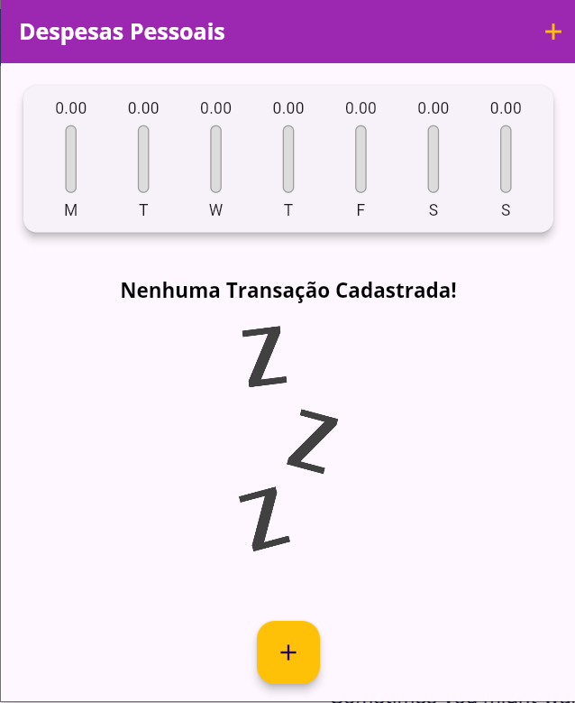
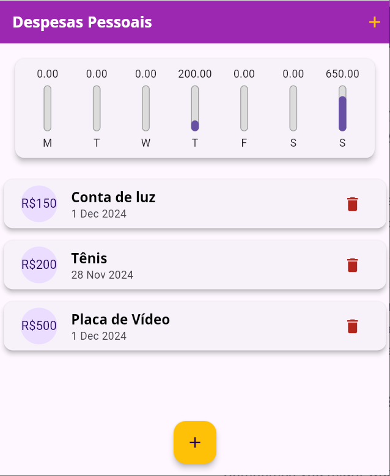

# Expenses-App

## Descrição

Projeto desenvolvido durante curso de Flutter da COD3R.

Consiste em um gerenciador de despesas pessoais, onde o usuário pode cadastrar suas despesas, estas que são organizadas em um gráfico semanal.

*Banco de dados não incluso

## Instalação

Clone o repositório:
   ```bash
   git clone https://github.com/oJaciel/Expenses-App
   ```
Instale as dependências:
    ```
    flutter pub get
    ```
    

Execute o aplicativo:
    ```
    flutter run
    ```

## Imagens



